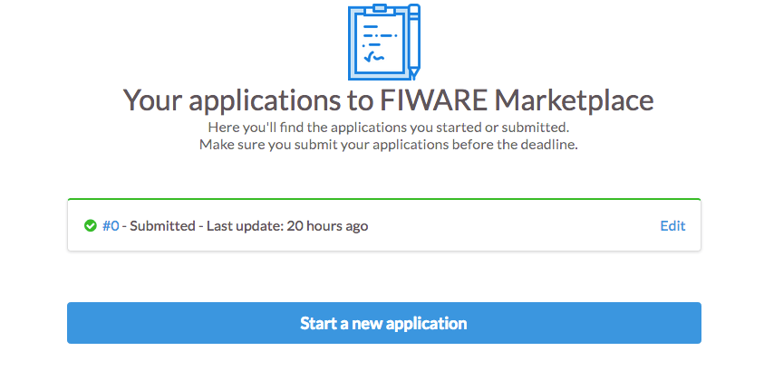
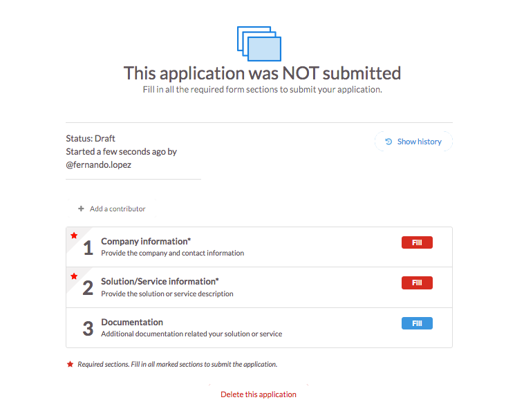

## Guidelines for applicants

In order for any device to be considered _"FIWARE Ready"_ it must be able to communicate **directly** (using NGSI) or
**indirectly** (using an IoT Agent) with the FIWARE Context Broker. Evidence can be obtained by running a
[series of tests](#test-scenarios) which must be passed successfully to show that a device can send and receive
information. Also, for actuators it must be possible to send commands down to the device initialized by NGSI requests.

For communication between IoT devices and Smart Solutions, the FIWARE ecosystem contains two major software components:

-   [FIWARE Context Broker](https://github.com/telefonicaid/fiware-orion): It is the main access point for developers
    using the [NGSI](https://fiware.github.io/specifications/OpenAPI/ngsiv2) Interface. Developers can retrieve the
    current context of an IoT device as a series of attributes of an entity. Developers may also send commands to
    devices by updating command-related attributes, provided they have access rights for those operations.
-   [FIWARE IoT Agents](https://github.com/Fiware/catalogue/tree/master/iot-agents). These components deal with
    southbound communications from the FIWARE Context Broker to IoT devices and also translate northbound communications
    from the device specific protocol into NGSI commands. This allows IoT integrators to connect devices, receive
    measurements and send commands.

Any IoT standard or proprietary protocol can be connected to FIWARE via the IoT Agent components. Currently FIWARE
provides IoT Agents for:

-   [IoT Agent for JSON](https://github.com/telefonicaid/iotagent-json) - a bridge between HTTP/MQTT messaging (with a
    JSON payload) and NGSI
-   [IoT Agent for LWM2M](https://github.com/telefonicaid/lightweightm2m-iotagent) - a bridge between the
    [Lightweight M2M](https://www.omaspecworks.org/what-is-oma-specworks/iot/lightweight-m2m-lwm2m/) protocol and NGSI
-   [IoT Agent for Ultralight](https://github.com/telefonicaid/iotagent-ul) - a bridge between HTTP/MQTT messaging (with
    an UltraLight2.0 payload) and NGSI
-   [IoT Agent for LoRaWAN](https://github.com/Atos-Research-and-Innovation/IoTagent-LoRaWAN) - a bridge between the
    [LoRaWAN](https://www.thethingsnetwork.org/docs/lorawan/) protocol and NGSI
-   [IoT Agent for OPC-UA](https://github.com/Engineering-Research-and-Development/iotagent-opcua) - a bridge between
    the [OPC Unified Architecture](http://www.opcua.us/) protocol and NGSI
-   [IoT Agent for Sigfox](https://github.com/telefonicaid/sigfox-iotagent) - a bridge between the
    [Sigfox](https://www.sigfox.com/en) protocol and NGSI

-   The [OpenMTC](https://github.com/OpenMTC/OpenMTC) Incubated Generic Enabler brings an open source implementation of
    the OneM2M standard. A northbound interface with the Orion Context Broker is implemented as part of the product.

There is also an [IoT Agent library](https://github.com/telefonicaid/iotagent-node-lib/) for developing your own IoT
Agent to cover any other possible IoT Standard not covered by the existing enablers.

New IoT Agents are being added over time, and the current supported set of protocols can be found within the
[FIWARE Catalogue](https://github.com/Fiware/catalogue/tree/master/iot-agents)

<h3 id="test-scenarios">Test Scenarios</h3>

<h4>Create a service</h4>

-   Objective: Verify that the implementation is capable of creating a new IoT service.
-   Applicability: Optional
-   Pass/Fail Criteria: The new IoT service is successfully created in the context broker.

<h4>Register a device</h4>

-   Objective: Verify that the IoT device implementation has been registered in the context broker.
-   Applicability: Mandatory
-   Pass/Fail Criteria: The context broker sends a status code message indicating that the device has been registered.
    No error message is received.

<h4>Get a device</h4>

-   Objective: Verify that it is possible to retrieve the list of existing devices.
-   Applicability: Optional
-   Pass/Fail Criteria: The registered devices appear in the list.

<h4>Send the measurement</h4>

-   Objective: Verify that the device implementation is able to send measurements.
-   Applicability: Mandatory
-   Pass/Fail Criteria: The measurements are accessible in the Context Broker.

<h4>Read the measurement</h4>

-   Objective: Verify that the device implementation is able to read measurements from the Context Broker.
-   Applicability: Optional
-   Pass/Fail Criteria: The device implementation is able to retrieve the measurements.

Please, save all the communication established with the IoT Stack software APIs during the execution of each of the
tests (responses you get).

Further information for self-assessment can be found [here](test-scenarios.md)

<h3>Fill in the <i>"FIWARE-Ready"</i> IoT Device Manual Template</h3>

Fill the template named
[_"FIWARE-Ready"_ IoT Device Manual Template](https://docs.google.com/document/d/1g_ic6Vy5g9i04Oe-kyFf8gxvP2862IVCGH9KJIqKuYk/edit).
This template requires you to describe how your hardware device communicates with FIWARE. If any sections within the
template do not make sense or not apply to your implementation, please explain the reason(s) in its corresponding place.
This document will be the basic one used by the user to configure and use your components, therefore, you should
describe in details how to connect the device to Orion Context Broker to send context information. If you have any
questions regarding the information in this template, you are welcome to contact the _"FIWARE-Ready"_ IoT Devices
Program reviewers [IoTReady@lists.fiware.org​](mailto:I​oTReady@lists.fiware.org​).

<h3>Fill in the information of your product into the marketplace</h3>

You can go to the marketplace and select [Apply](https://www.fiware.org/marketplace/submit-your-product) to upload a new component to be
validated. It goes to the ​ web page in which you can select **Start a new application**.

If you want to validate several _"FIWARE-Ready"_ IoT Devices please remember to fill in multiple seaparate applications.
This information will describe us how your hardware device communicates with FIWARE.

You can see that the status is Draft which means that it is not sent to the reviewers yet. Additionally, you have the
possibility to delete this application if it was not delivered for validation yet. If you click on **Fill** button in
the **Company information** box, the form requests you to introduce the name and logo of the company, address, city,
country and contact email. All of them all mandatory to validate your _"FIWARE-Ready"_ IoT Device. If you click on
**Fill** button in the **Solution/Service information** box, the form request you to fill in the technical detail about
your solution in order that the reviewers can validate the solution. It is very important that you provide the URL to
download software drivers/libraries/components, tutorial and guidelines facilitating the integration with FIWARE.
Concretely, you should put here the ​URL to the filled template that we presented in section 4.4​. Additionally, you
must provide ​files or screenshots of the responses you have obtained during the testing against the IoT Stack software
APIs in all Testing Workflow tests. This content should be introduced in \_Additional documentation describing how the
solution/technology uses or integrates with FIWARE.

<h3>Submit application</h3>

Once that you finish with the process to introduce the data, you can submit the data to start the validation process.

_"FIWARE-Ready"_ IoT Device Program reviewers will evaluate the provided documentation and contact with you in case any
clarification is required. The result of this evaluation will be a Test Report that will be published in the marketplace
application page. Once the evaluation is finished, you have successfully completed the _"FIWARE-Ready"_ IoT Device
Program, and your device will be published on the list of _"FIWARE-Ready"_ IoT Devices commercial devices available in
the **FIWARE Marketplace** :`https://marketplace.fiware.org/pages/devices`. Once the product is validated you will also
be able to publish in your own web the program logo and specific instructions to connect your product to FIWARE
ecosystems (based on a template we will provide as well).

## Guideline for validators

In order to proceed with the validation of a FIWARE-Ready IoT device validators must follow these steps:

1. Check the information provided by the applicants. There must be at least a filled-in manual template.
2. Check that this template explains all the necessary steps to work with FIWARE generic enablers.
3. Check that the applicants have performed the required steps.
4. Check the logs, IoT Agent information and Orion Context Broker entries to confirm that those steps were performed.
5. If there is no evidence that the actions were simulated and overall process looks logical, that means that the
   validation has passed successfully. If not, ask to provide more details.

<h3>Possible infrastructure</h3>

Infrastructure should provide a possibility to check the connectivity with IoT Agents and message brokers. All endpoints
can be proxied by NGINX, since its log contains enough information about all TCP and HTTP connections. Sample
docker-compose file with a part of the required infrastructure, as well as instructions and variables for Postman
recipes prepared for applicants' guidelines are located at `https://github.com/FIWARE-Ops/Marketplace/tree/validators`.
