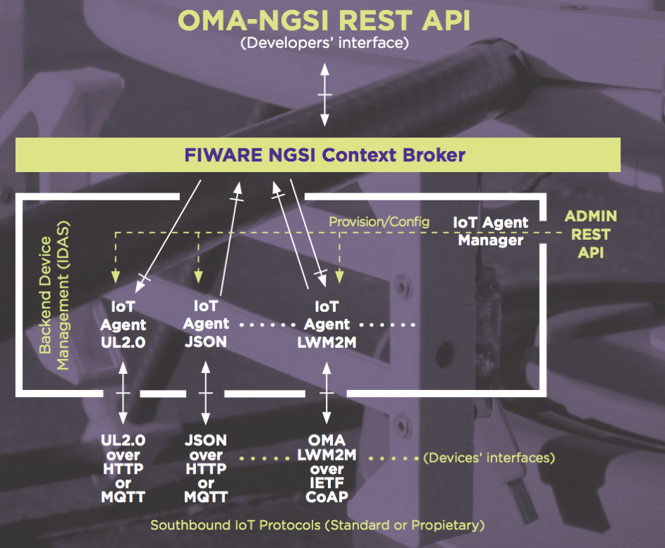

## Guidelines for applicants

Smart solutions incorporate a feedback loop into their functionality - (capture - process - actuate) capturing context
information and making decisions based on augmented context data, then actuating devices to change the state of the real
world, leading to the execution of "smart" actions which improve existing processes. Such context data can be supplied
from many different sources (end users, IoT devices, public open data sources, IT systems, social networks etc.) and may
be highly distributed.

The figure below illustrates the typical device architecture of a _"Powered by FIWARE"_ smart solution. The _FIWARE
Context Broker_ is the key component which allows systems to capture, manage and provide access to context information
at high scale, in a standardized manner. Furthermore, smart solutions are able to use the _FIWARE IoT Agent_ suite for
connecting IoT devices as context information datasources in a common abstract manner, so that dynamic context data is
made available, regardless IoT protocols or networks.

FIWARE also offers extra connectors (_Cygnus_, _STH-Comet_, _QuantumLeap_, _Draco_) which enable the generation of short
term or longer term historical information and storing it in different datastores, such as HDFS, MongoDB or
Elasticsearch (CrateDB). Thereafter Big Data Processing or Machine Learning algorithms can be used to performed further
insights, predictions or other advanced analytics.. Further information for developers can be found on
[fiware.org](https://www.fiware.org/developers). Similarly, the catalogue of open-source FIWARE standard components can
be found on [GitHub](https://www.fiware.org/developers/catalogue)

An example of a smart solution, would be one intended to optimize waste collection service in a city. The service would
gather context data (filling levels) from IoT devices attached to waste containers. IoT Devices will send measurements
to a FIWARE IoT Agent, which will store them in an instance of FIWARE Context Broker. Thus IoT devices would act as
providers of context information. Likewise, a route optimization service (context data consumer) will use such context
information to optimize picking up routes so that only those containers fully filled will be visited. A city dashboard
could also act as context data consumer offering a visualization solution, so that city officials can follow, in real
time, the status of containers or even vehicles dedicated to waste collection. For providing and consuming context data,
applications will make use of the FIWARE NGSI standard APIs. Last but not least, historical data could be generated
using _Cygnus_ or _Draco_ and stored on a Big Data system so that analytics can be performed.

## Guideline for validators

In order to proceed with the validation of a _"Powered by FIWARE"_ Solution validators must follow these steps:

1. Check all the information provided by applicants. At least there must be a document which clearly describes the
   architecture and data models employed by the solution.

2. Revise the architecture of the solution and try to respond to the following questions:

    - a) Is the FIWARE Context Broker the main architectural component used to store information coming from data
      providers?
    - b) Is the FIWARE Context Broker the main architectural component used to offer information to data consumers?
    - c) Is the FIWARE NGSI interface the main mechanism used to ingest and consume information within the application?

3. Revise the supplied data models (as per the documentation or schemas provided) of the application and try to respond
   to the following questions:

    - a) Are the application data models suitable to be used with FIWARE NGSI? Usually data entities should correspond
      to some concrete object with a state found the real world. Events or tickets make very poor candidates for data
      entities.
    - b) Are the application data models compatible with the FIWARE Data Models? An application data model is compatible
      if it can be mapped to an existing FIWARE Data Model (through an ETL) or if it is just an extension of an existing
      FIWARE Data Model.

4. From the documentation provided, there must be clear evidence to infer affirmative responses to all the questions
   under points 2 and 3 (either a. or b.). Note that common data models must be used where they exist, but are not
   mandatory for novel use-cases where a common data model has not yet been created. In the later case, for the new data
   model or additional attributes for an existing data model should be extending common vocabulary where possible and
   follow the usual rules for data models (e.g attributes in English, camel case etc.). For common future use, in the
   ideal case the candidate should be encouraged to submit a new common data model or add additional fields as
   necessary.

    If there is no clear evidence that an end-to-end solution exists, then evaluators must call for an interview, so
    that the applicant can provide extra evidence to pass points 2 and 3. Extra evidence could be provided by giving
    further verbal explanations and/or demoing against an application environment (for instance using Postman or similar
    tools). A demo user could be requested by the corresponding FIWARE Validation Center, allowing the validation to be
    done online. It is acceptable during the demo for the user to emulate the information provider and consumer against
    the Context Broker with the consent of the FIWARE Validation Center.

5. Once there is clear evidence of 2 and 3 evaluators must generate a short report summarizing the main evidence
   provided to pass points 2 and 3, i.e. why, in their judgment, the solution is _"Powered by FIWARE"_.

6. If evaluators cannot find enough evidence for points 2 and 3 the application must be rejected.
